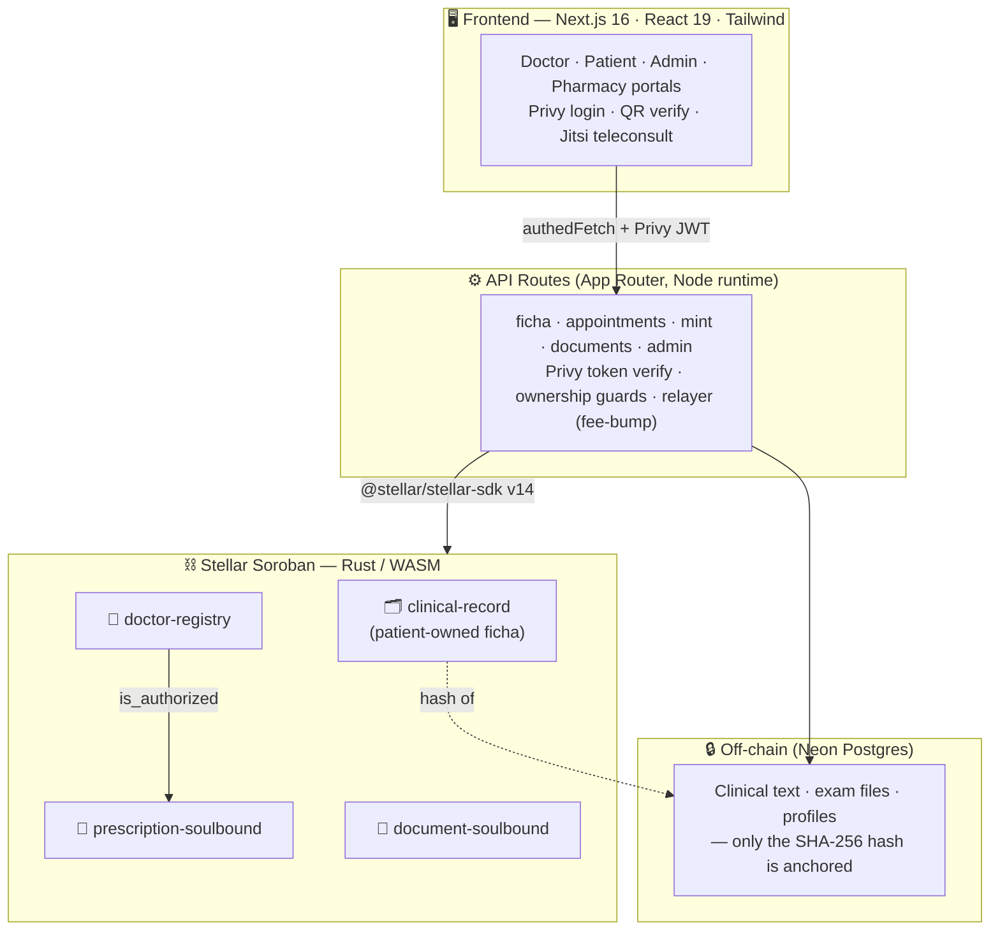

<div align="center">

# 🌿 TrustLeaf

### Patient-owned medical records on Stellar Soroban

Doctors issue **clinical records, prescriptions, and medical licenses** whose
**integrity is anchored on-chain** — tamper-evident, patient-owned, and
publicly verifiable. The sensitive data stays **off-chain and encrypted**; only
its cryptographic proof touches the blockchain.

[](https://stellar.org)
[](https://nextjs.org)
[](https://www.typescriptlang.org)
[](https://www.rust-lang.org)
[](https://privy.io)

[](https://github.com/CaBsCrypto/ficha-onchain/actions/workflows/contracts.yml)
[](#-license)

</div>

---

## The problem

In Chile — and most of the world — your medical history is **fragmented across
clinics** that don't talk to each other. Change doctors and your record doesn't
follow you. Prescriptions and sick-leave certificates are **paper (or PDFs) that
are trivial to forge**, and there's no public way to check if one is real.

## The solution

**TrustLeaf makes the patient the owner of their record.** Every clinical
event — a consultation note, a prescription, a medical license, a lab result —
is written to a record the **patient controls**, and its cryptographic hash is
**anchored on Stellar Soroban**. A doctor can only write to your record after
**you grant them access on-chain**. Anyone can verify a prescription or a
certificate is authentic — no account required — while the actual medical data
never leaves the encrypted, off-chain store.

---

## 🩺 The flow, at a glance

```
   👩‍⚕️ DOCTOR                    ⛓️ STELLAR SOROBAN                🧑 PATIENT / 🏥 PHARMACY
  ┌──────────────┐            ┌────────────────────────┐        ┌────────────────────────┐
  │ Writes an    │  ──sign──▶ │  Anchors the SHA-256    │ ──QR─▶ │ Verifies authenticity  │
  │ entry / Rx / │  (gasless, │  hash + issues a        │  scan  │ & status — publicly,   │
  │ license      │  relayed)  │  soulbound token        │        │ no login required      │
  └──────────────┘            └────────────────────────┘        └────────────────────────┘
        ▲                                                                 
        │ patient granted write-access on-chain (consent)                 
        └───────────────────────── 🧑 PATIENT ───────────────────────────┘
```

> **Soulbound** = non-transferable. A prescription is bound to the patient's
> wallet — it can be issued, dispensed, or revoked, but never sold or forged.

---

## 🏗️ Architecture



**Three ideas make it work:**

1. **Anchor the hash, not the data.** The chain stores a 32-byte SHA-256 of each
   clinical event plus soulbound tokens for prescriptions/licenses. The
   plaintext (notes, files, PII) lives off-chain — tamper-evident *and* private.
2. **Consent is on-chain.** A doctor can only `append_entry` to your
   `clinical-record` after you call `grant_write_access` — a real transaction you
   sign. Revoke it and they lose access.
3. **Gasless UX.** Users never hold XLM. A **relayer fee-bumps** every
   transaction, so signing is free for doctors and patients.

📖 Deep dive: **[docs/ARCHITECTURE.md](./docs/ARCHITECTURE.md)** ·
**[docs/CONTRACTS.md](./docs/CONTRACTS.md)** · **[docs/API.md](./docs/API.md)**

---

## 📜 Smart contracts (Soroban Testnet)

Rust → WASM, in [`contracts/`](./contracts). Built in CI (the Rust toolchain is
blocked locally) and deployed with the `stellar` CLI.

| Contract | Role | Key methods | Testnet ID |
|---|---|---|---|
| **clinical-record** | The patient-owned ficha | `grant_write_access` · `append_entry` · `get_entries` | [`CCATYIFO…22GY5`](https://stellar.expert/explorer/testnet/contract/CCATYIFOHLLRS6CMONJQZ66A6QN3Z7EQFU3O4HD4RMTNS67F2U422GY5) |
| **prescription-soulbound** | Non-transferable Rx (Decreto 41) | `mint_prescription` · `activate` · `dispense` · `revoke` | [`CA3I4NLB…LXYL`](https://stellar.expert/explorer/testnet/contract/CA3I4NLBELODRXUUBVZDBVAU47W65KPZ6UFWEXCEEDUDQYZQ4E5YLXYL) |
| **document-soulbound** | Licenses & certificates (9 types) | `mint_document` · `get_document` · `revoke_document` | [`CBNX6WYT…CMON`](https://stellar.expert/explorer/testnet/contract/CBNX6WYTQUWTKKJSDLKARXQHONUW6H435CSZ4VA6O4U7TGI5E2IVCMON) |
| **doctor-registry** | Who may prescribe + permissions | `register_doctor` · `is_authorized` · `grant_permission` | [`CC246CYK…2X2O`](https://stellar.expert/explorer/testnet/contract/CC246CYKOEAZVKWEJGOXTKW436LYYLR2EHKFD2WFGABXGSFX2UEX2X2O) |
| `dispensary-registry` · `dispense-record` | Pharmacy dispensation | — | ⏳ not yet deployed |

> Full method tables, storage layout, and the on-chain/off-chain data map:
> **[docs/CONTRACTS.md](./docs/CONTRACTS.md)**.

---

## ✨ Features

| | Feature | On-chain? |
|--|---|:--:|
| 🗂️ | **Ficha clínica** — doctor writes clinical entries to the patient-owned record | ✅ hash |
| 🩹 | **Antecedentes** — vitals, allergies, chronic conditions (treating-doctor edits) | off-chain¹ |
| 🔬 | **Exams / labs** — attach a PDF/image; its hash is anchored | ✅ hash |
| 💊 | **Prescriptions** — soulbound Rx, QR-verifiable, **Decreto 41** compliant | ✅ token |
| 📜 | **Medical licenses** — sick-leave & certificates, publicly verifiable | ✅ token |
| 🤝 | **Consent** — patient grants/revokes a doctor's write-access on-chain | ✅ tx |
| 📅 | **Booking & teleconsult** — availability → slots → Jitsi video room | — |
| 🛡️ | **Admin panel** — approve doctors, live system flow + global activity log | — |
| 🏥 | **Pharmacy panel** — verify & dispense a prescription | ✅ tx |

<sub>¹ Antecedentes are currently stored off-chain only; anchoring their hash
on-chain (like clinical entries) is a planned consistency improvement.</sub>

---

## 🧰 Tech stack

| Tech | Version | Purpose |
|---|---|---|
| Next.js | `16.2` | App Router, API routes, Turbopack |
| React | `19.2` | UI runtime |
| TypeScript | `5.x` | End-to-end type safety |
| Tailwind | `v4` | Clinical-blue / mint design system |
| **@stellar/stellar-sdk** | `14.6` | Soroban RPC & tx building (pinned — v13 can't parse protocol 27) |
| **Privy** | `1.87` | Embedded Stellar wallets, Google/email login |
| Rust · soroban-sdk | — | Smart contracts (WASM) |
| Neon Postgres | — | Off-chain store (serverless) |

Plus **passkey-kit** (passkey wallets) · **qrcode** (QR) · **jose** (JWT share
tokens) · **Jitsi** (teleconsult, no OAuth needed).

---

## 🚀 Getting started

```bash
git clone https://github.com/CaBsCrypto/ficha-onchain.git
cd ficha-onchain
npm install
cp .env.example .env.local        # fill in DATABASE_URL + (optional) signer secrets
node scripts/migrate.mjs          # apply the schema (idempotent)
npm run dev                       # http://localhost:3000
```

> 💡 **Demo mode out of the box.** Leave the signer secrets blank and on-chain
> writes degrade to `mode:"simulated"` so every screen still works. Add
> `DEMO_DOCTOR_SECRET` + `RELAYER_SECRET` to anchor for real on testnet.

Run the checks:

```bash
npm run test:phases    # 23/23 — the 8 journey phases, end to end
npm run test:flow      # 13/13 — integrated E2E over the HTTP API
npm run test:onchain   # 11/11 — real Soroban anchoring
```

📖 Run the full logged-in two-portal demo: **[docs/DEMO.md](./docs/DEMO.md)**.

---

## ⚖️ Compliance

- **🇨🇱 Decreto 41 (MINSAL)** — digital prescriptions follow the format, required
  prescriber/patient fields, and validity windows of Chile's Reglamento de
  Farmacias.
- **🔒 Ley 20.584 (patient rights)** — the patient owns and controls access to
  their record. PII never touches the chain; only the hash of the encrypted
  payload is anchored.

---

## 🗺️ Roadmap

- [x] Patient-owned clinical record (`clinical-record`) — consent + on-chain entries
- [x] Prescriptions on-chain (soulbound) + QR verification + activation
- [x] Medical licenses & certificates (`document-soulbound`)
- [x] Structured antecedentes + exam/lab attachments (hash anchored)
- [x] Doctor onboarding + admin approval + activity log
- [x] Booking, consent handshake, teleconsultation
- [ ] Anchor antecedentes hash on-chain (consistency)
- [ ] Pharmacy dispensation contracts on-chain
- [ ] Self-custody signing (patient's own wallet signs, replacing demo relayer keys)
- [ ] Mainnet deployment · EHR / insurer / lab integrations

---

## 📚 Documentation

| Doc | What's inside |
|---|---|
| [docs/ARCHITECTURE.md](./docs/ARCHITECTURE.md) | On-chain/off-chain model, signing + relayer, auth & enforcement, data flow |
| [docs/CONTRACTS.md](./docs/CONTRACTS.md) | Every contract: methods, storage, deployed IDs, what goes on-chain |
| [docs/API.md](./docs/API.md) | The REST API surface, grouped by portal, with the auth model per route |
| [docs/DATA_MODEL.md](./docs/DATA_MODEL.md) | Postgres schema + the on-chain vs off-chain data map |
| [docs/DEMO.md](./docs/DEMO.md) | Run the full logged-in médico↔paciente demo, two sessions |
| [CONTRIBUTING.md](./CONTRIBUTING.md) | Dev setup, the branch-per-PR flow, CI gates |

---

## 📄 License

**Proprietary — © 2026 Browns Studio. All rights reserved.** This source code is
made available for evaluation purposes only. No license is granted to use, copy,
modify, distribute, or create derivative works.

<div align="center">

**Built on Stellar Soroban.** Launching first in 🇨🇱 Chile.

</div>
