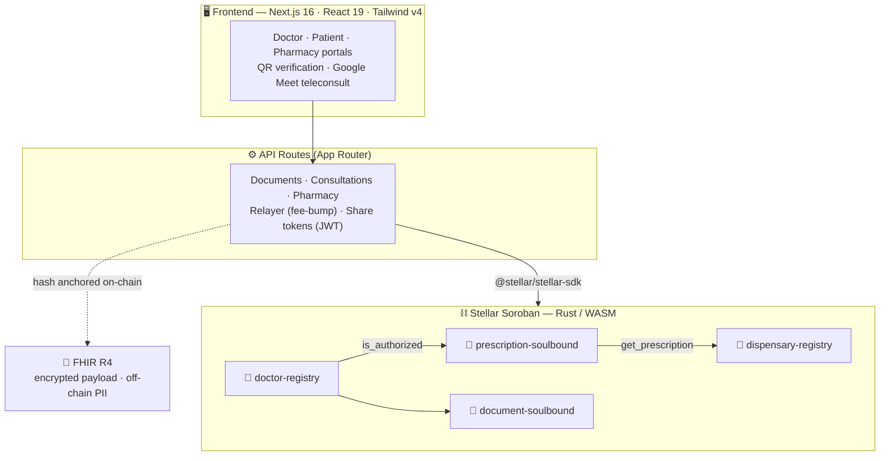

<div align="center">

# 🌿 TrustLeaf

### On-chain medical records on Stellar Soroban

Doctors issue **clinical records, prescriptions, and medical licenses** as
**soulbound NFTs** — tamper-proof, patient-owned, and publicly verifiable.

[](https://stellar.org)
[](https://nextjs.org)
[](https://www.typescriptlang.org)
[](https://www.rust-lang.org)
[](https://hl7.org/fhir/R4/)

[](https://github.com/CaBsCrypto/ficha-onchain/actions/workflows/contracts.yml)
[](#-license)

</div>

---

## 🩺 The flow, at a glance

```
   👩‍⚕️  DOCTOR                 ⛓️  STELLAR BLOCKCHAIN                🧑  PATIENT / 🏥 PHARMACY
  ┌──────────────┐            ┌───────────────────────┐            ┌───────────────────────┐
  │  Issues a    │  ── sign ─▶│  Seals it as a         │  ── QR ──▶│  Verifies authenticity │
  │  document    │  (Passkey) │  soulbound NFT +       │  scan     │  & status — publicly,  │
  │  (Rx / cert) │            │  on-chain hash         │           │  no login required     │
  └──────────────┘            └───────────────────────┘            └───────────────────────┘
       EMITS                        VERIFIES · SEALS                       VERIFIES
```

> **Soulbound** = non-transferable. A prescription is bound to the patient's
> wallet — it can be issued, dispensed, or revoked, but never sold or forged.

<div align="center">


_🎬 Interactive demo — **(coming soon)**_

</div>

---

## 🏗️ Architecture



- **On-chain stores only a hash** of the encrypted FHIR R4 payload — PII stays
  off-chain, encrypted with patient-held keys.
- **Fee-less UX** — patients never pay gas; a relayer sponsors transactions.
- **Passkey auth** — doctors sign with a device passkey, no seed phrases.

---

## ⚡ How it works

| # | Step | What happens |
|---|------|--------------|
| 1️⃣ | **Doctor registers** | A licensed prescriber is authorized in `doctor-registry` (with extensible permissions). |
| 2️⃣ | **Doctor issues a document** | A prescription, license, or certificate is minted as a soulbound NFT to the patient's wallet. |
| 3️⃣ | **Blockchain seals it** | Soroban anchors the document hash, issuer, timestamp, and status — immutable and timestamped. |
| 4️⃣ | **Anyone verifies via QR** | Patient or pharmacy scans a QR to confirm authenticity and status on-chain — **no account needed**. |

---

## ✨ Features

| | Feature | Description |
|--|---------|-------------|
| 🩺 | **Ficha Clínica** | On-chain medical consultations with dedicated doctor & patient portals. |
| 💊 | **Prescriptions** | Digital soulbound prescriptions, QR-verifiable — compliant with **Decreto 41** (MINSAL Chile). |
| 📜 | **Licenses** | Medical certificates & professional licenses across **9 types**, publicly verifiable. |
| 🏥 | **Pharmacy Panel** | Pharmacists verify prescriptions and mark them dispensed on-chain. |
| 🎥 | **Google Meet** | Integrated teleconsultation — spin up a Meet room straight from a consultation. |
| 🔑 | **On-chain Permissions** | Extensible permission system (`CANNABIS`, `MNT_HLTH`, …) — add capabilities with **no redeploy**. |

---

## 📜 Smart Contracts

Soroban contracts written in Rust, compiled to WASM (`contracts/`).

| Contract | Function | Status |
|----------|----------|--------|
| `doctor-registry` | Registers doctors & grants extensible permissions | 🟢 `deployed (testnet)` |
| `prescription-soulbound` | Non-transferable prescription NFTs | 🟢 `deployed (testnet)` |
| `document-soulbound` | Soulbound medical licenses & certificates | 🟡 `testnet` |
| `dispensary-registry` | Registry of verified pharmacies | 🟡 `testnet` |

> Deployed testnet IDs live in [`.env.example`](./.env.example).
> See [`contracts/README.md`](./contracts/README.md) for the on-chain design.

---

## 🧰 Tech stack

| Tech | Version | Purpose |
|------|---------|---------|
|  | `16.2` | App Router, API routes, Turbopack |
|  | `19.2` | UI runtime |
|  | `5.x` | End-to-end type safety |
|  | `4.x` | Clinical-blue / mint design system |
|  | `13.3` | Soroban RPC & transaction building |
|  | `soroban-sdk` | Smart contracts |
|  | `0.185` | 3D patient card (WebGL) |
|  | `R4` | Interoperable clinical data model |

Plus: **framer-motion** (animations) · **passkey-kit** (passkey wallets) ·
**qrcode** (QR generation) · **googleapis** (Meet) · **jose** (JWT share tokens).

---

## 🚀 Getting started

```bash
# 1. Clone
git clone https://github.com/CaBsCrypto/ficha-onchain.git
cd ficha-onchain

# 2. Install
npm install

# 3. Configure environment
cp .env.example .env.local     # then fill in the values below

# 4. Run
npm run dev                    # http://localhost:3000
```

Build for production with `npm run build && npm start`.

> 💡 Every seam runs in **demo mode** out of the box — leave passkeys, pharmacy
> keys, and the Meet integration blank and the app works against mock/testnet
> data. No infra required to explore.

---

## 🔐 Environment variables

Copy [`.env.example`](./.env.example) → `.env.local`. Key variables:

| Variable | Description | Required |
|----------|-------------|:--------:|
| `NEXT_PUBLIC_STELLAR_NETWORK` | Target network (`testnet` / `public`) | ✅ |
| `NEXT_PUBLIC_SOROBAN_RPC_URL` | Soroban RPC endpoint | ✅ |
| `NEXT_PUBLIC_DOCTOR_REGISTRY_ID` | Deployed `doctor-registry` contract ID | ✅ |
| `NEXT_PUBLIC_PRESCRIPTION_ID` | Deployed `prescription-soulbound` contract ID | ✅ |
| `RELAYER_SECRET` | Funded testnet account that fee-bumps transactions | ✅ |
| `JWT_SECRET` | HS256 signing key for 15-min share tokens | ✅ |
| `NEXT_PUBLIC_PASSKEY_ENABLED` | Toggle real passkey login (`false` = mock wallets) | ⚪️ |
| `DISPENSARY_REGISTRY_ID` | `dispensary-registry` contract ID (Phase 1) | ⚪️ |
| `DISPENSE_RECORD_ID` | `dispense-record` contract ID (Phase 1) | ⚪️ |
| `PHARMACY_API_KEYS` | `apikey:GWALLET,…` map for the pharmacy API | ⚪️ |
| `PHARMACY_PIN` | 6-digit PIN gating the pharmacist console | ⚪️ |
| `NEXT_PUBLIC_RX_VALIDITY_DAYS` | Prescription validity window (default `30`) | ⚪️ |
| `GOOGLE_CLIENT_ID` / `GOOGLE_CLIENT_SECRET` | OAuth for Google Meet teleconsult | ⚪️ |
| `NEXT_PUBLIC_APP_URL` | Public base URL (OAuth callbacks) | ✅ |

⚪️ = optional (blank → demo mode). Server-only secrets belong in your host's
project settings, **never** in the repo.

---

## ⚖️ Compliance

- **🇨🇱 Decreto 41 (MINSAL)** — digital prescriptions follow the format and
  validity rules of Chile's Reglamento de Farmacias, including derived expiry
  windows and the required prescriber/patient fields.
- **🧬 FHIR R4** — clinical data is modeled on HL7 FHIR R4 resources for
  interoperability. Only the **hash** of the encrypted payload touches the
  chain; PII stays off-chain under patient-held keys.

---

## 🗺️ Roadmap

- [x] Prescriptions on-chain (soulbound) + QR verification
- [x] Doctor registry with extensible permissions (`CANNABIS`, `MNT_HLTH`)
- [x] Pharmacy panel — verify & dispense
- [x] Medical licenses & certificates (`document-soulbound`)
- [x] Google Meet teleconsultation
- [ ] Full FHIR R4 clinical records (patient-owned history)
- [ ] Mainnet deployment
- [ ] AI health agent over patient-authorized records
- [ ] Ecosystem integrations (EHRs, insurers, labs)

---

## 📄 License

**Proprietary — © 2026 Browns Studio. All rights reserved.** This source code is
made available for evaluation purposes only. No license is granted to use, copy,
modify, distribute, or create derivative works.

<div align="center">

**Built on Stellar Soroban.** Launching first in 🇨🇱 Chile.

</div>

---

© 2026 Browns Studio. All rights reserved. This source code is made available for evaluation purposes only. No license is granted to use, copy, modify, distribute, or create derivative works.
