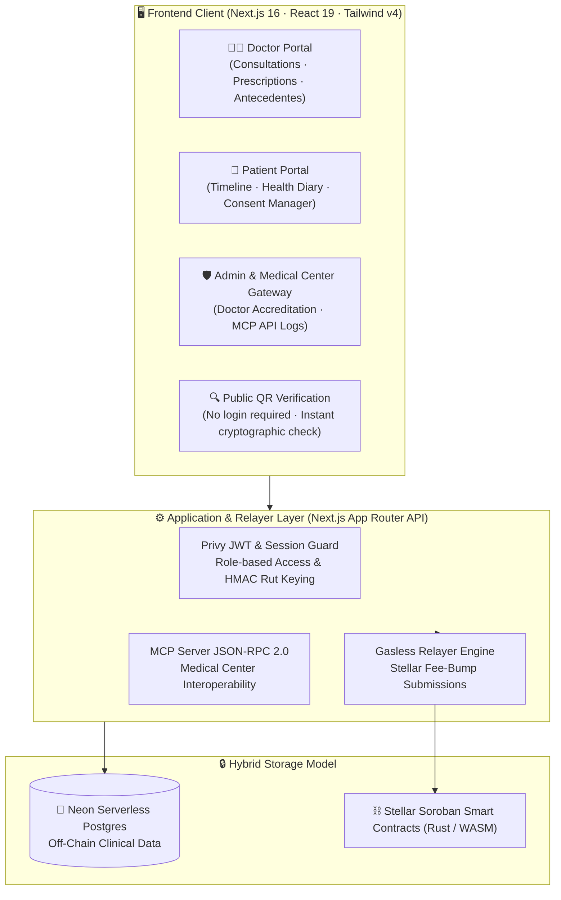

<div align="center">


# 🌿 TrustLeaf

### Patient-Owned Clinical Records & Smart Prescriptions on Stellar Soroban

Doctors issue **clinical records, prescriptions, and medical licenses** whose **integrity is anchored on-chain** — tamper-evident, patient-owned, and publicly verifiable. Clinical content is stored off-chain; hashes, wallet addresses, metadata and token states are recorded on-chain. Off-chain storage alone does not establish encryption or privacy compliance.

[](https://stellar.org)
[](https://nextjs.org)
[](https://www.typescriptlang.org)
[](https://www.rust-lang.org)
[](https://privy.io)

[](https://github.com/CaBsCrypto/ficha-onchain/actions/workflows/contracts.yml)
[](https://github.com/CaBsCrypto/ficha-onchain/actions/workflows/ci.yml)
[](./docs/sow-delivery/WEEK_1.md)
[](#-license)

</div>

---

## 🎯 The Problem

In Chile — and across Latin America — medical history is **fragmented across clinics, hospitals, and private practices** that operate in isolated silos. When patients change doctors, their clinical record is lost. Furthermore:
- **Paper & PDF Prescriptions** are easily forged, altered, or duplicated without centralized anti-fraud mechanisms.
- **Medical Sick-Leave Certificates (Licencias Médicas)** suffer from lack of instant authenticity verification.
- **Patients lack sovereign control** over who accesses their confidential health history.

## 💡 The Solution

**TrustLeaf puts the patient at the center of their healthcare data:**
1. **Sovereign Patient Records:** Clinical consultations, lab results, and medical notes form a timeline owned by the patient.
2. **On-Chain Cryptographic Anchoring:** Every clinical event produces a deterministic SHA-256 hash anchored into Stellar Soroban smart contracts.
3. **Soulbound Prescriptions:** Non-transferable digital prescriptions minted to the patient's wallet with built-in anti-duplicate enforcement and QR validation.
4. **On-Chain Consent Handshake:** ClinicalRecord supports patient-controlled write permissions. MCP sandbox consent is automatically issued for demonstrations, not signed by a patient; live consent remains pending.
5. **Zero Friction (Gasless UX):** A configured relayer pays fees through Stellar fee-bumps. Week 1 verifies synthetic SDK transactions; portal behavior depends on deployment credentials and mode.

---

## 🩺 Clinical & Verification Flow

This diagram describes the intended integrated flow. Week 1 validates the two prescription contracts and relay; not every portal or consent interaction shown here has been verified.

```
   👩‍⚕️ ACCREDITED DOCTOR              ⛓️ STELLAR SOROBAN                 🧑 PATIENT / 🏥 PHARMACY
  ┌─────────────────────────┐       ┌─────────────────────────┐       ┌─────────────────────────┐
  │ 1. Writes clinical note │ ────▶ │ 2. Anchors SHA-256 hash │ ────▶ │ 3. Inspects real-time   │
  │    or issues Rx/license │ (gas) │    & issues Soulbound Rx│  QR   │    timeline or verifies │
  │    via Doctor Portal    │ Relay │    with duplicate check │ Scan  │    authenticity on-chain│
  └─────────────────────────┘       └─────────────────────────┘       └─────────────────────────┘
               ▲                                                                   ▲
               │          4. Explicit On-Chain Consent Handshake                   │
               └───────────────────────────────────────────────────────────────────┘
```

> 🔒 **Soulbound Tokens:** Non-transferable tokens bound strictly to the patient's address. They can be created, activated, dispensed, or revoked, and cannot be traded or transferred after issuance. Duplicate checks reject the same issuer, patient and document hash, including after revocation; they do not identify clinically equivalent treatments in different documents.

---

## 🏗️ System Architecture


```mermaid
flowchart TD
    subgraph Frontend["🖥️ Frontend Client (Next.js 16 · React 19 · Tailwind v4)"]
        DPortal["👩‍⚕️ Doctor Portal<br/>(Consultations · Prescriptions · Antecedentes)"]
        PPortal["🧑 Patient Portal<br/>(Timeline · Health Diary · Consent Manager)"]
        Admin["🛡️ Admin & Medical Center Gateway<br/>(Doctor Accreditation · MCP API Logs)"]
        Verify["🔍 Public QR Verification<br/>(No login required · Instant cryptographic check)"]
    end

    subgraph Backend["⚙️ Application & Relayer Layer (Next.js App Router API)"]
        Auth["Privy JWT & Session Guard<br/>Role-based Access & HMAC Rut Keying"]
        Relay["Gasless Relayer Engine<br/>Stellar Fee-Bump Submissions"]
        MCP["MCP Server JSON-RPC 2.0<br/>Medical Center Interoperability"]
    end

    subgraph Storage["🔒 Hybrid Storage Model"]
        Neon[("🐘 Neon Serverless Postgres<br/>Off-Chain Clinical Data")]
        Soroban["⛓️ Stellar Soroban Smart Contracts (Rust / WASM)"]
    end

    Frontend --> Backend
    Backend --> Neon
    Backend --> Relay
    Relay --> Soroban
```

---

## ✅ Verified Week 1 Scope

DoctorRegistry and PrescriptionSoulbound are deployed on Stellar Testnet. Evidence records 36 Week 1 Rust tests, 118 app tests and 11 Testnet checks, including synthetic fee-bump transactions and RPC simulation of rejected issuance. The existing registry was retained; only the new prescription WASM was matched byte-for-byte to its local artifact.

The delivery was merged through [PR #95](https://github.com/CaBsCrypto/ficha-onchain/pull/95), with verification timestamps updated in [PR #98](https://github.com/CaBsCrypto/ficha-onchain/pull/98). GitHub CI and Vercel passed after that merge. Formal owner acceptance and a full authenticated browser walkthrough are separate from these checks. See the [Week 1 report](./docs/sow-delivery/WEEK_1.md) and [delivery index](./docs/sow-delivery/INDEX.md).

---

## 📜 Smart Contracts (Stellar Soroban Testnet)

Compiled with `stellar contract build` (`wasm32v1-none`) and tested locally via Rust test harness (`cargo test`).

| Contract | Purpose | Key Methods | Testnet Contract ID | Status |
| :--- | :--- | :--- | :--- | :---: |
| **`DoctorRegistry`** | On-chain registry of accredited doctors & permissions | `register_doctor`, `is_authorized`, `grant_permission` | [`CC246CYKOEAZVKWEJGOXTKW436LYYLR2EHKFD2WFGABXGSFX2UEX2X2O`](https://stellar.expert/explorer/testnet/contract/CC246CYKOEAZVKWEJGOXTKW436LYYLR2EHKFD2WFGABXGSFX2UEX2X2O) | ✅ **Live / SOW 1** |
| **`PrescriptionSoulbound`** | Non-transferable Rx with anti-duplicate atomic guard | `mint_prescription`, `activate`, `dispense`, `revoke` | [`CBOJSLG2XQZNQ6G6Q4VGN2SOFOEUCRDMBDWS7HVOQTGWTOIWGWNQSLCU`](https://stellar.expert/explorer/testnet/contract/CBOJSLG2XQZNQ6G6Q4VGN2SOFOEUCRDMBDWS7HVOQTGWTOIWGWNQSLCU) | ✅ **Live / SOW 1** |
| **`ClinicalRecord`** | Patient-owned decentralized clinical record | `grant_write_access`, `append_entry`, `get_entries` | [`CCATYIFOHLLRS6CMONJQZ66A6QN3Z7EQFU3O4HD4RMTNS67F2U422GY5`](https://stellar.expert/explorer/testnet/contract/CCATYIFOHLLRS6CMONJQZ66A6QN3Z7EQFU3O4HD4RMTNS67F2U422GY5) | ✅ Active Testnet |
| **`DocumentSoulbound`** | Sick-leave licenses & certificates (9 clinical types) | `mint_document`, `get_document`, `revoke_document` | [`CBNX6WYTQUWTKKJSDLKARXQHONUW6H435CSZ4VA6O4U7TGI5E2IVCMON`](https://stellar.expert/explorer/testnet/contract/CBNX6WYTQUWTKKJSDLKARXQHONUW6H435CSZ4VA6O4U7TGI5E2IVCMON) | ✅ Active Testnet |

> 📖 **SOW Deliverable 1 Audit:** Detailed validation logs, synthetic testnet fee-bump txs, and WASM byte-exact verification are documented in **[docs/sow-delivery/WEEK_1.md](./docs/sow-delivery/WEEK_1.md)**.

---

## ✨ Features Matrix

These are project modules and implementation surfaces, not a claim that every flow is production-ready or covered by Week 1 acceptance.

| Module | Feature Description | Storage / Execution | Verification |
| :--- | :--- | :---: | :---: |
| 🗂️ **Ficha Clínica** | Consultation history, symptoms, diagnoses and medical notes | Neon DB + SHA-256 on Soroban | Tamper-evident hash comparison |
| 💊 **Recetas Digitales** | Soulbound prescriptions with lifecycle and duplicate checks | Soroban State Token | Public QR verify & Dispense API |
| 📜 **Licencias Médicas** | Digital medical leaves & specialty certificates | Soroban State Token | On-chain status check |
| 🤝 **Consent Engine** | Patient grants / revokes write permission to specific doctors | Soroban Access Control | On-chain authorization check |
| 🩹 **Pain & Health Diary** | Patient self-reported pain tracking with 3D anatomical body map | Neon DB (off-chain) | Doctor consultation view |
| 🤖 **MCP JSON-RPC API** | Standardized medical center protocol to anchor clinical events | JSON-RPC 2.0 Endpoint | API Key + Patient RUT HMAC-SHA256 |
| 📹 **Teleconsultation** | Integrated video rooms with Jitsi without OAuth overhead | WebRTC | Dynamic ephemeral rooms |

---

## 🚀 Quickstart & Local Development

### 1. Prerequisites
- **Node.js**: `v22.x`
- **Rust & Cargo**: Latest stable (with target `wasm32v1-none` via `stellar contract build`)
- **Stellar CLI**: `v27.0.0` (used by contract CI)

### 2. Installation & Setup

```bash
# Clone the repository
git clone https://github.com/CaBsCrypto/ficha-onchain.git
cd ficha-onchain

# Install dependencies (respects pinned stellar-sdk v14)
npm ci

# Setup environment variables
cp .env.example .env.local
# Fill in development credentials; DATABASE_URL must target a dev database.

# Run idempotent database migration
node scripts/migrate.mjs

# Start local development server
npm run dev
```

Visit [`http://localhost:3000`](http://localhost:3000) to access the application.

---

## 🧪 Verification & Test Suites

We enforce rigorous automated testing across Rust smart contracts and Next.js frontend/backend routes:

```bash
# 1. Run all unit & integration tests (118+ Vitest tests)
npm test

# 2. Run TypeScript strict typecheck (0 errors policy)
npx tsc --noEmit

# 3. Run Soroban smart contract Rust tests (36+ tests)
cargo test --manifest-path contracts/Cargo.toml

# 4. Run SOW Week 1 Local Validation suite
node scripts/validate-week1-local.mjs

# 5. Run Live Testnet Contract Audit
node scripts/verify-week1-testnet.mjs
```

---

## ⚖️ Privacy & Regulatory Scope

TrustLeaf is a Testnet prototype for clinical records and prescriptions. Week 1 testing is technical evidence, not certification of legal compliance, clinical readiness, or end-to-end encryption. Regulatory and security review remain necessary before handling real clinical data in a production workflow.

Clinical content is kept off-chain by design, while public wallet addresses, hashes and metadata can still reveal relationships. Authentication enforcement depends on deployment flags. MCP sandbox consent is labeled `auto_sandbox`; live anchoring is not enabled by that demonstration.

---

## 📚 Documentation Index

- **[SOW Week 1 Delivery & Audit Report](./docs/sow-delivery/WEEK_1.md)**
- **[System Architecture & Data Flows](./docs/ARCHITECTURE.md)**
- **[Smart Contracts Specification & Storage](./docs/CONTRACTS.md)**
- **[REST & JSON-RPC API Reference](./docs/API.md)**
- **[Postgres & On-Chain Data Model](./docs/DATA_MODEL.md)**
- **[End-to-End Two-Portal Demo Guide](./docs/DEMO.md)**

---

## 📄 License

**Proprietary — © 2026 Browns Studio / CaBsCrypto. All rights reserved.**  
This source code is made available for evaluation and SOW validation purposes.

<div align="center">

Built with 💙 on **Stellar Soroban**. Launching first in 🇨🇱 **Chile**.

</div>
