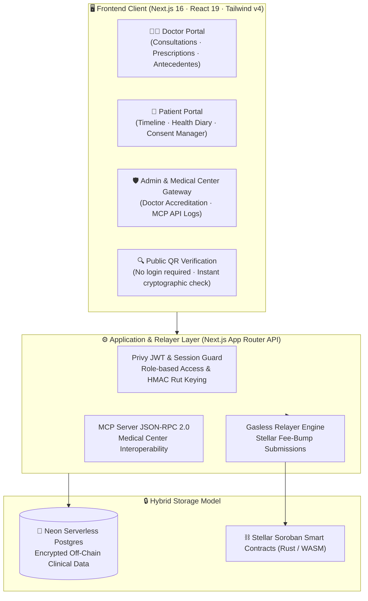

<div align="center">


# 🌿 TrustLeaf

### Patient-Owned Clinical Records & Smart Prescriptions on Stellar Soroban

Doctors issue **clinical records, prescriptions, and medical licenses** whose **integrity is anchored on-chain** — tamper-evident, patient-owned, and publicly verifiable. Sensitive health data remains **off-chain, encrypted, and private**; only cryptographic proofs and non-transferable token states touch the blockchain.

[](https://stellar.org)
[](https://nextjs.org)
[](https://www.typescriptlang.org)
[](https://www.rust-lang.org)
[](https://privy.io)

[](https://github.com/CaBsCrypto/ficha-onchain/actions/workflows/contracts.yml)
[](https://github.com/CaBsCrypto/ficha-onchain/actions/workflows/ci.yml)
[](./docs/sow-delivery/WEEK_1.md)
[](#-license)

</div>

---

## 🎯 The Problem

In Chile — and across Latin America — medical history is **fragmented across clinics, hospitals, and private practices** that operate in isolated silos. When patients change doctors, their clinical record is lost. Furthermore:
- **Paper & PDF Prescriptions** are easily forged, altered, or duplicated without centralized anti-fraud mechanisms.
- **Medical Sick-Leave Certificates (Licencias Médicas)** suffer from lack of instant authenticity verification.
- **Patients lack sovereign control** over who accesses their confidential health history.

## 💡 The Solution

**TrustLeaf puts the patient at the center of their healthcare data:**
1. **Sovereign Patient Records:** Clinical consultations, lab results, and medical notes form a timeline owned by the patient.
2. **On-Chain Cryptographic Anchoring:** Every clinical event produces a deterministic SHA-256 hash anchored into Stellar Soroban smart contracts.
3. **Soulbound Prescriptions (Decreto 41):** Non-transferable digital prescriptions minted to the patient's wallet with built-in anti-duplicate enforcement and QR validation.
4. **On-Chain Consent Handshake:** Doctors can only append records or read medical history after explicit, on-chain patient authorization.
5. **Zero Friction (Gasless UX):** Patients and doctors never need XLM to sign; a relayer handles fee-bumps seamlessly.

---

## 🩺 Clinical & Verification Flow

```
   👩‍⚕️ ACCREDITED DOCTOR              ⛓️ STELLAR SOROBAN                 🧑 PATIENT / 🏥 PHARMACY
  ┌─────────────────────────┐       ┌─────────────────────────┐       ┌─────────────────────────┐
  │ 1. Writes clinical note │ ────▶ │ 2. Anchors SHA-256 hash │ ────▶ │ 3. Inspects real-time   │
  │    or issues Rx/license │ (gas) │    & issues Soulbound Rx│  QR   │    timeline or verifies │
  │    via Doctor Portal    │ Relay │    with duplicate check │ Scan  │    authenticity on-chain│
  └─────────────────────────┘       └─────────────────────────┘       └─────────────────────────┘
               ▲                                                                   ▲
               │          4. Explicit On-Chain Consent Handshake                   │
               └───────────────────────────────────────────────────────────────────┘
```

> 🔒 **Soulbound Tokens:** Non-transferable tokens bound strictly to the patient's address. They can be created, activated, dispensed, or revoked, but can never be traded, transferred, or duplicated.

---

## 🏗️ System Architecture


```mermaid
flowchart TD
    subgraph Frontend["🖥️ Frontend Client (Next.js 16 · React 19 · Tailwind v4)"]
        DPortal["👩‍⚕️ Doctor Portal<br/>(Consultations · Prescriptions · Antecedentes)"]
        PPortal["🧑 Patient Portal<br/>(Timeline · Health Diary · Consent Manager)"]
        Admin["🛡️ Admin & Medical Center Gateway<br/>(Doctor Accreditation · MCP API Logs)"]
        Verify["🔍 Public QR Verification<br/>(No login required · Instant cryptographic check)"]
    end

    subgraph Backend["⚙️ Application & Relayer Layer (Next.js App Router API)"]
        Auth["Privy JWT & Session Guard<br/>Role-based Access & HMAC Rut Keying"]
        Relay["Gasless Relayer Engine<br/>Stellar Fee-Bump Submissions"]
        MCP["MCP Server JSON-RPC 2.0<br/>Medical Center Interoperability"]
    end

    subgraph Storage["🔒 Hybrid Storage Model"]
        Neon[("🐘 Neon Serverless Postgres<br/>Encrypted Off-Chain Clinical Data")]
        Soroban["⛓️ Stellar Soroban Smart Contracts (Rust / WASM)"]
    end

    Frontend --> Backend
    Backend --> Neon
    Backend --> Relay
    Relay --> Soroban
```

---

## 📜 Smart Contracts (Stellar Soroban Testnet)

Compiled with `stellar contract build` (`wasm32v1-none`) and tested locally via Rust test harness (`cargo test`).

| Contract | Purpose | Key Methods | Testnet Contract ID | Status |
| :--- | :--- | :--- | :--- | :---: |
| **`DoctorRegistry`** | On-chain registry of accredited doctors & permissions | `register_doctor`, `is_authorized`, `grant_permission` | [`CC246CYKOEAZVKWEJGOXTKW436LYYLR2EHKFD2WFGABXGSFX2UEX2X2O`](https://stellar.expert/explorer/testnet/contract/CC246CYKOEAZVKWEJGOXTKW436LYYLR2EHKFD2WFGABXGSFX2UEX2X2O) | ✅ **Live / SOW 1** |
| **`PrescriptionSoulbound`** | Non-transferable Rx with anti-duplicate atomic guard | `mint_prescription`, `activate`, `dispense`, `revoke` | [`CBOJSLG2XQZNQ6G6Q4VGN2SOFOEUCRDMBDWS7HVOQTGWTOIWGWNQSLCU`](https://stellar.expert/explorer/testnet/contract/CBOJSLG2XQZNQ6G6Q4VGN2SOFOEUCRDMBDWS7HVOQTGWTOIWGWNQSLCU) | ✅ **Live / SOW 1** |
| **`ClinicalRecord`** | Patient-owned decentralized clinical record | `grant_write_access`, `append_entry`, `get_entries` | [`CCATYIFOHLLRS6CMONJQZ66A6QN3Z7EQFU3O4HD4RMTNS67F2U422GY5`](https://stellar.expert/explorer/testnet/contract/CCATYIFOHLLRS6CMONJQZ66A6QN3Z7EQFU3O4HD4RMTNS67F2U422GY5) | ✅ Active Testnet |
| **`DocumentSoulbound`** | Sick-leave licenses & certificates (9 clinical types) | `mint_document`, `get_document`, `revoke_document` | [`CBNX6WYTQUWTKKJSDLKARXQHONUW6H435CSZ4VA6O4U7TGI5E2IVCMON`](https://stellar.expert/explorer/testnet/contract/CBNX6WYTQUWTKKJSDLKARXQHONUW6H435CSZ4VA6O4U7TGI5E2IVCMON) | ✅ Active Testnet |

> 📖 **SOW Deliverable 1 Audit:** Detailed validation logs, synthetic testnet fee-bump txs, and WASM byte-exact verification are documented in **[docs/sow-delivery/WEEK_1.md](./docs/sow-delivery/WEEK_1.md)**.

---

## ✨ Features Matrix

| Module | Feature Description | Storage / Execution | Verification |
| :--- | :--- | :---: | :---: |
| 🗂️ **Ficha Clínica** | Consultation history, symptoms, diagnoses and medical notes | Neon DB + SHA-256 on Soroban | Tamper-evident hash comparison |
| 💊 **Recetas Digitales** | Soulbound prescriptions compliant with Chile's Decreto 41 | Soroban State Token | Public QR verify & Dispense API |
| 📜 **Licencias Médicas** | Digital medical leaves & specialty certificates | Soroban State Token | On-chain status check |
| 🤝 **Consent Engine** | Patient grants / revokes write permission to specific doctors | Soroban Access Control | On-chain authorization check |
| 🩹 **Pain & Health Diary** | Patient self-reported pain tracking with 3D anatomical body map | Neon DB (Encrypted) | Doctor consultation view |
| 🤖 **MCP JSON-RPC API** | Standardized medical center protocol to anchor clinical events | JSON-RPC 2.0 Endpoint | API Key + Patient RUT HMAC-SHA256 |
| 📹 **Teleconsultation** | Integrated video rooms with Jitsi without OAuth overhead | WebRTC | Dynamic ephemeral rooms |

---

## 🚀 Quickstart & Local Development

### 1. Prerequisites
- **Node.js**: `v22.x`
- **Rust & Cargo**: Latest stable (with target `wasm32v1-none` via `stellar contract build`)
- **Stellar CLI**: `v22+`

### 2. Installation & Setup

```bash
# Clone the repository
git clone https://github.com/CaBsCrypto/ficha-onchain.git
cd ficha-onchain

# Install dependencies (respects pinned stellar-sdk v14)
npm install

# Setup environment variables
cp .env.example .env.local

# Run idempotent database migration
node scripts/migrate.mjs

# Start local development server
npm run dev
```

Visit [`http://localhost:3000`](http://localhost:3000) to access the application.

---

## 🧪 Verification & Test Suites

We enforce rigorous automated testing across Rust smart contracts and Next.js frontend/backend routes:

```bash
# 1. Run all unit & integration tests (118+ Vitest tests)
npm test

# 2. Run TypeScript strict typecheck (0 errors policy)
npx tsc --noEmit

# 3. Run Soroban smart contract Rust tests (36+ tests)
cargo test --manifest-path contracts/Cargo.toml

# 4. Run SOW Week 1 Local Validation suite
node scripts/validate-week1-local.mjs

# 5. Run Live Testnet Contract Audit
node scripts/verify-week1-testnet.mjs
```

---

## ⚖️ Regulatory Compliance & Privacy

- **🇨🇱 Decreto 41 (MINSAL - Chile):** Complies with the regulatory standards for digital and electronic medical prescriptions in Chile, including doctor credentials, patient identifiers, and expiration intervals.
- **🔒 Ley 20.584 (Derechos y Deberes de los Pacientes):** Ensures the patient remains the sovereign owner of their clinical record. Sensitive Personally Identifiable Information (PII) is encrypted off-chain and never exposed publicly on the blockchain ledger.

---

## 📚 Documentation Index

- **[SOW Week 1 Delivery & Audit Report](./docs/sow-delivery/WEEK_1.md)**
- **[System Architecture & Data Flows](./docs/ARCHITECTURE.md)**
- **[Smart Contracts Specification & Storage](./docs/CONTRACTS.md)**
- **[REST & JSON-RPC API Reference](./docs/API.md)**
- **[Postgres & On-Chain Data Model](./docs/DATA_MODEL.md)**
- **[End-to-End Two-Portal Demo Guide](./docs/DEMO.md)**

---

## 📄 License

**Proprietary — © 2026 Browns Studio / CaBsCrypto. All rights reserved.**  
This source code is made available for evaluation and SOW validation purposes.

<div align="center">

Built with 💙 on **Stellar Soroban**. Launching first in 🇨🇱 **Chile**.

</div>
