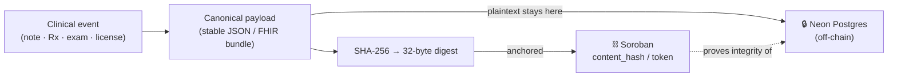
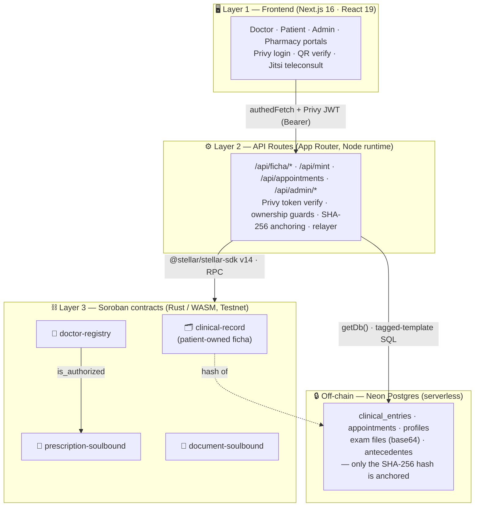
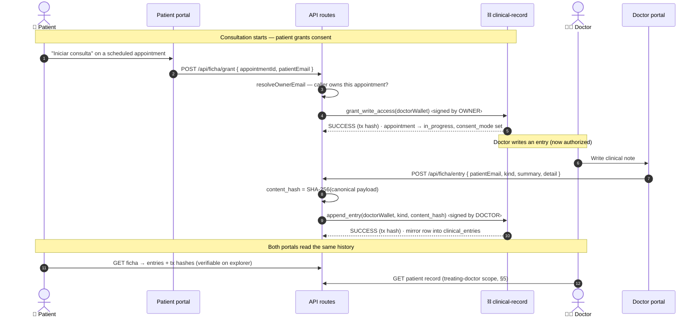
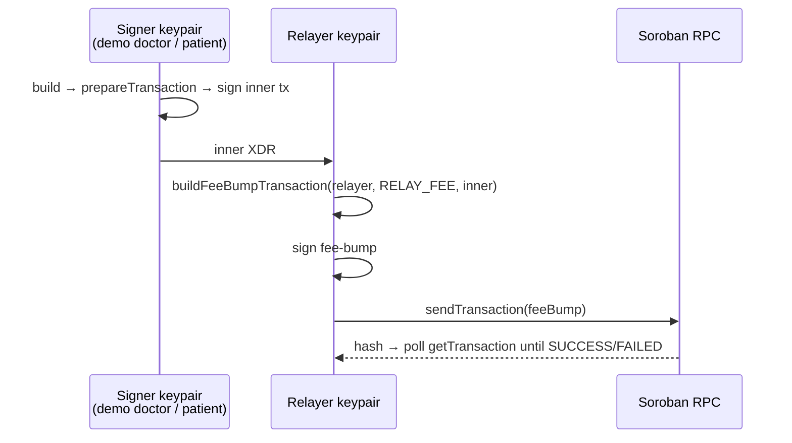
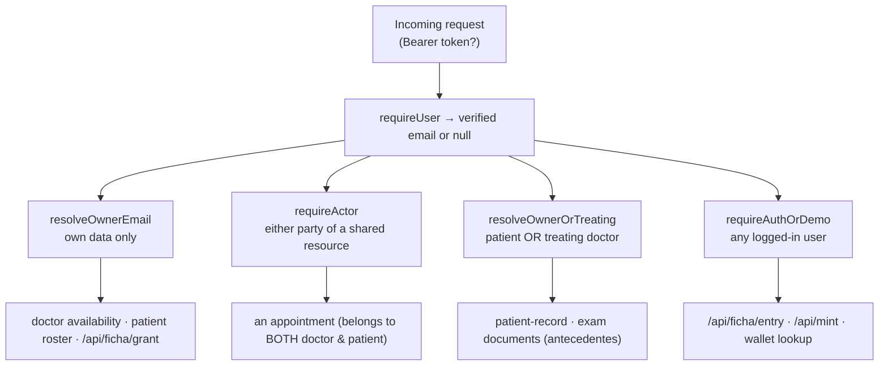

# 🏗️ TrustLeaf — Architecture

> Patient-owned medical records on **Stellar Soroban**. Doctors issue clinical
> entries, prescriptions, and licenses whose **integrity is anchored on-chain**;
> the sensitive data stays **off-chain and private**. This document explains how
> that works — the trust model, the layers, the consent flow, and the honest
> gaps.

For the contract-by-contract reference see [CONTRACTS.md](./CONTRACTS.md);
for the REST surface see the API docs. This file is the *why* and the *shape*.

---

## 1. The core idea — anchor the hash, not the data

A medical record has two irreconcilable requirements: it must be **tamper-evident**
(you can prove a note or a prescription was not altered after the fact) and it must
be **private** (diagnoses, RUT, addresses, lab PDFs are among the most sensitive
data a person has). Putting the record on a public blockchain satisfies the first
and violates the second. Keeping it in a clinic database satisfies the second and
violates the first.

**TrustLeaf splits the two.** For every clinical event we compute a 32-byte
`SHA-256` digest of a canonical payload and anchor *only that digest* on-chain.
The plaintext — notes, files, PII — never leaves the off-chain store.

The digest is a one-way commitment. To **verify** a record later, you re-hash the
off-chain payload and compare it against the anchor: if a single byte changed, the
hashes diverge and the tampering is exposed. But the anchor reveals nothing about
the content — a hash is not reversible into the diagnosis behind it. You get
tamper-evidence *and* privacy from the same 32 bytes.

Concretely, the derivation happens server-side before anything touches the chain:

- **Clinical entries** — `content_hash = SHA-256(JSON.stringify({ patientEmail, kind, summary, detail }))`, with a stable key order so the same clinical content always reproduces the same anchor. (`src/app/api/ficha/entry/route.ts`)
- **Prescriptions** — the Decreto 41 record is assembled into a **canonical FHIR R4 Bundle**, and `rx_hash = SHA-256(canonical bundle)`. (`src/app/api/mint/route.ts`)

### Why this is the compliant design

- **🔒 Ley 20.584 (Chilean patient rights).** The law makes the patient the owner
  of their clinical record and the controller of who accesses it. TrustLeaf
  enforces both properties structurally: the record contract's owner is the
  patient, and access requires an on-chain grant the patient signs (§3). PII
  never touches the chain, so the public ledger cannot leak it.
- **FHIR-style modeling.** Prescriptions are canonicalized as **FHIR R4 Bundles**
  before hashing, so the anchored artifact corresponds to a real interoperability
  standard rather than an ad-hoc blob — the same payload can be exchanged with an
  EHR later, and its hash still verifies.

---

## 2. The three layers

TrustLeaf is a three-tier system with an off-chain store hanging off the middle
tier. The browser never talks to Soroban directly; all signing and all database
access is mediated by the Node-runtime API routes.

**Layer 1 — Frontend.** Four role portals (doctor, patient, admin, pharmacy).
Login is a Privy embedded Stellar wallet (Google / email). Every call to the
backend carries the Privy access token as a `Bearer` header.

**Layer 2 — API routes.** Next.js App Router handlers, pinned to the **Node
runtime** (`export const runtime = "nodejs"`) because they use `node:crypto` for
hashing and the Stellar SDK for signing — neither runs on the Edge runtime. This
layer is the trust boundary: it verifies the caller's identity (§5), computes the
hash, decides on-chain vs simulated, signs and submits transactions (§4), and
mirrors everything into Postgres.

**Layer 3 — Soroban contracts.** Rust → WASM on Stellar Testnet. IDs live in
`src/lib/stellar/config.ts` (with `NEXT_PUBLIC_*` env overrides). The network
passphrase and RPC URL are selected there from `NEXT_PUBLIC_STELLAR_NETWORK`
(defaulting to `testnet`). Key contracts: `clinical-record` (per-patient ficha),
`doctor-registry` (who may prescribe), `prescription-soulbound`, and
`document-soulbound` (licenses/certificates).

**Off-chain store — Neon Postgres.** A single client is created in
`src/lib/db.ts` via `getDb()`, which replaced five drifted copies that each grew
their own error text. Schema lives in `scripts/migrate.mjs` and nowhere else —
never in a route handler. Routes that can run without a database degrade to demo
mode via `isDbConfigured()`.

---

## 3. On-chain consent model

The heart of the "patient owns the record" claim is that a doctor **cannot write
to a patient's ficha until the patient grants them access on-chain**. This is not
a database flag the backend could flip on its own — it is a real Soroban
transaction the patient signs, enforced by the contract itself.

The `clinical-record` contract is deployed **per patient**, with the patient's
wallet fixed as the owner at deploy time. It exposes:

- `grant_write_access(grantee)` — sets the grantee's write flag. The contract
  calls `require_owner()`, so **only the owner's signature is accepted**. A relayer
  fee-bump (§4) does *not* count as that inner signature.
- `append_entry(author, kind, content_hash)` — appends an anchored entry. The
  contract rejects it `Unauthorized` unless `author` holds write access. The
  grantee wallet passed to `grant_write_access` **must be the exact wallet** that
  later signs `append_entry`, or the append reverts.

So the causal chain is: **patient grants → doctor appends → both read.** Without
step 1, step 2 is impossible on-chain — the consent is a hard precondition, not a
courtesy.

The grant is bound to a **booking event**: `/api/ficha/grant` fires from the
"Iniciar consulta" button, verifies the caller is the patient on that appointment,
resolves the doctor's grantee wallet, submits the on-chain grant, and then marks
the appointment `in_progress` while recording `consent_tx`, `consent_mode`, and
`consent_wallet`. That `consent_mode` column is what later authorizes the doctor
to touch off-chain antecedentes and exams (the "treating relationship" of §5).

---

## 4. Signing & gasless UX

Two problems stand between a clinical action and a confirmed Soroban transaction:
**who signs**, and **who pays the fee**. TrustLeaf's answer keeps the user from
ever holding XLM, and is deliberately honest about the current custody model.

### The relayer makes it gasless

Every on-chain write is **fee-bumped by a relayer**. The signer (doctor or
patient) signs the inner transaction; the relayer wraps it in a
`FeeBumpTransaction`, signs *that*, and submits it — so the original signer spends
no XLM. This is `feeBumpAndSend(innerXdr)` in `src/lib/stellar/server.ts`, with a
0.2 XLM ceiling (`RELAY_FEE`), plenty for a Soroban invoke.

### One signing path, with a sequence-collision retry

`appendClinicalEntry` and `grantWriteAccess` both funnel through a shared
`signInvokeAndSubmit` helper — same fee, 60-second timeout, prepare-then-sign
order, and fee-bump. The signer is also the transaction source, which satisfies
the contract's `require_auth`.

The subtle part is **sequence numbers**. Back-to-back invokes from the same demo
signer collide on the account sequence and fail `txBadSeq`. `signInvokeAndSubmit`
fetches the account **inside** each attempt (so every retry picks up a fresh
sequence) and retries up to 3 times with a 1.5 s backoff. Without this retry, a
transient collision would silently drop the write to `simulated`.

### Graceful degradation to `mode:"simulated"`

The demo signer secrets are **gated on the relayer being configured**:
`getDemoDoctorSecret()` / `getDemoPatientSecret()` return `undefined` unless
`RELAYER_SECRET` is set. When there is no signer — or a transaction still fails
after its retries — the API does not error out. It writes the entry off-chain
anyway and returns `mode:"simulated"` with a human-readable `reason`, so the UI
flow always completes:

| Situation | Result |
|---|---|
| Relayer + signer configured, tx succeeds | `mode:"onchain"` + tx hash + explorer link |
| No signer (relayer/secret unset) | `mode:"simulated"`, `reason: "sin firmante configurado…"` |
| Tx fails after 3 retries | `mode:"simulated"`, `reason: "transacción FAILED"` |
| Doctor not authorized in DoctorRegistry (mint) | `mode:"simulated"` with the authorization reason |

The off-chain mirror row is written in **every** case, which is what lets both
portals render a consistent history whether or not the anchor landed.

### ⚠️ Honest note: this is a demo-custody model

In the current build the server holds the demo keypairs (`DEMO_DOCTOR_SECRET`,
`DEMO_PATIENT_SECRET`) and signs on the user's behalf. That is a **custodial
shortcut for the demo** — it lets the médico↔paciente flow run end-to-end without
requiring passkey/wallet-signing infrastructure in the browser.

The **planned real model is self-custody**: the patient's (and doctor's) own
**Privy embedded wallet signs in the browser**, and the signed XDR is POSTed to a
relay endpoint that only fee-bumps it. The server would then *never* see a private
key — it would only pay the fee. The `mint` route already documents this intended
split ("in production the doctor would sign step 2 with their passkey wallet in the
browser and POST the signed XDR to `/api/relay`"). Until that lands, treat the demo
keys as exactly that: demo keys, not a custody design for production.

---

## 5. Auth & ownership enforcement

Identity comes from **Privy**, the app's real login (Google / email embedded
Stellar wallets). The only trustworthy answer to "who is asking?" is the verified
Privy access token — never a `?email=` query param, which earlier routes trusted
and which let anyone read or overwrite a record by guessing an address (emails are
not secrets; they appear in every appointment row).

### `requireUser` — verifying identity

`requireUser(request)` (`src/lib/auth/privy-auth.ts`) pulls the `Bearer` token,
calls `privy.verifyAuthToken`, then resolves the caller's email **across login
methods**: email-OTP accounts store it under `.address`, OAuth (Google) accounts
under `.email`. Looking only at `type === "email"` once rejected every Google-only
user, so both are checked. It **fails closed** — any failure (missing token,
invalid signature, expired, Privy unreachable) returns `null`, which callers must
treat as *denied*, never *allow*.

### The enforcement flag

`authEnforced()` is `true` when `TRUSTLEAF_REQUIRE_AUTH === "true"` (or
`NEXT_PUBLIC_PASSKEY_ENABLED === "true"`). It is **off by default** so the demo and
the HTTP flow tests work token-less. Flip it in production and every guarded route
rejects anonymous callers. With a token present, the guards enforce owner-only
access *regardless* of the flag.

### Four guards, four scopes

| Guard | Allows | On mismatch | Token-less (demo) |
|---|---|---|---|
| `resolveOwnerEmail(req, claimedEmail)` | token email == `claimedEmail` (own data) | `403` | passes through with `claimedEmail` (or `401` if enforced) |
| `requireActor(req, [emails])` | token email in candidate list (shared resource) | `403` | first candidate trusted (or `401` if enforced) |
| `resolveOwnerOrTreating(req, patientEmail)` | the patient **or** a treating doctor | `403` | `actor:"demo"` passthrough (or `401` if enforced) |
| `requireAuthOrDemo(req)` | any valid token | — | passthrough (or `401` if enforced) |

The **treating relationship** (`src/lib/auth/treating.ts`) is what lets a doctor
touch a patient's off-chain antecedentes and exams without a `?email=` free-for-all.
`hasTreatingRelationship(doctorEmail, patientEmail)` is true only when they share
an appointment whose `consent_mode IS NOT NULL` — i.e. the patient granted consent
in §3. That single rule lives in one place so `/api/doctor/patient-record` and
`/api/ficha/document` cannot drift apart. `resolveOwnerOrTreating` resolves a
request to `actor: 'patient' | 'doctor' | 'demo'` accordingly, returning `403` to a
logged-in user who is neither owner nor treating.

The design principle throughout: **demo mode passes token-less calls through**
(so the flow scripts and the live demo work), while a **present token is always
enforced** — you can never use a valid token to reach someone else's data, flag or
no flag.

---

## 6. What is on-chain vs off-chain

The dividing line is simple: **integrity proofs and ownership go on-chain;
plaintext, PII, and files stay off-chain.** The table below is the exact map — and
it flags the one place where the model is not yet consistent.

| Artifact | On-chain | What is anchored | Off-chain (Neon) |
|---|:--:|---|---|
| **Consent / grant** | ✅ tx | `grant_write_access` — owner-signed write flag on the record | `appointments.consent_tx / consent_mode / consent_wallet` |
| **Clinical entry** (ficha) | ✅ hash | `content_hash` = SHA-256 of `{patientEmail, kind, summary, detail}` | full `summary` / `detail` plaintext in `clinical_entries` |
| **Exam / lab file** | ✅ hash | SHA-256 of the file, anchored as a clinical entry | the **file itself (base64)** lives off-chain |
| **Prescription** | ✅ token | soulbound Rx token + `rx_hash` (SHA-256 of the FHIR bundle) | full Decreto 41 record, patient PII |
| **License / certificate** | ✅ token | soulbound document token (`document-soulbound`) | certificate detail, patient PII |
| **Antecedentes** (vitals, allergies, chronic conditions) | ❌ | **nothing** | **DB only** — structured rows, no on-chain anchor |

### 🚩 The honest gap: antecedentes are off-chain only

Everything else in TrustLeaf follows the anchor-the-hash rule — clinical entries,
exam files, prescriptions, and licenses all carry an on-chain proof. **Structured
antecedentes (vitals, allergies, chronic conditions) currently do not.** They are
edited by the treating doctor and stored only in Postgres, with no `content_hash`
committed to the record contract.

This is a **known inconsistency, not a hidden one.** Antecedentes are exactly the
kind of clinical data that should be tamper-evident, and the fix is
mechanical — hash the canonical antecedentes payload and `append_entry` it to the
patient's `clinical-record`, the same way clinical entries already work. It is on
the roadmap as "anchor antecedentes hash on-chain (consistency)". Until then, treat
antecedentes as trusted-database data, not blockchain-verified data.

---

## Appendix — key source files

| Concern | File |
|---|---|
| Signing, relayer, retry, demo-secret gating | `src/lib/stellar/server.ts` |
| Contract IDs, network, passphrase, explorer links | `src/lib/stellar/config.ts` |
| Privy identity + ownership guards | `src/lib/auth/privy-auth.ts` |
| Treating-relationship authorization | `src/lib/auth/treating.ts` |
| Single Postgres entry point | `src/lib/db.ts` |
| Clinical entry append (hash + on-chain/simulated) | `src/app/api/ficha/entry/route.ts` |
| Consent grant (owner-signed, booking-bound) | `src/app/api/ficha/grant/route.ts` |
| Prescription mint (FHIR bundle → rx_hash) | `src/app/api/mint/route.ts` |
| Schema (idempotent) | `scripts/migrate.mjs` |
