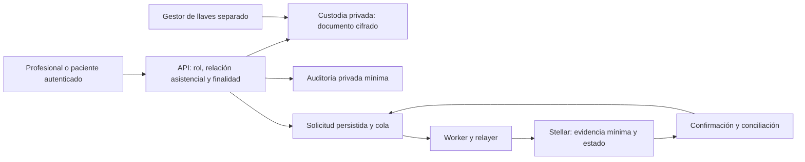

# Arquitectura recomendada y coordinación — TrustLeaf

Diseño documental, 2026-09-07 UTC. No implantado ni desplegado. Prioridad: SOW1 con datos sintéticos; no producción clínica ni ZK completo dentro de este hito. La base/proveedor de almacenamiento sigue pendiente de decisión operativa; la política de seguridad no depende de elegirlo.

## Explicación breve

El documento médico vive en almacenamiento privado. La API decide quién puede leerlo o actuar según identidad, rol y relación asistencial; el cifrado limita exposición del almacenamiento, pero no reemplaza esa decisión. Stellar conserva evidencia mínima para comprobar integridad y estado. Poner datos en blockchain —aunque estén cifrados— no los hace automáticamente anónimos ni permite retirarlos después.

Estado actual documentado: recetas incluyen medicamento/dosis públicos y la persistencia de recetas no demuestra cifrado de aplicación. Hay cifrado en otros flujos con límites; ver MEDICAL_DATA_FLOW.md. La siguiente figura es la **propuesta**, no una descripción de implementación terminada.

La propuesta usa claves de datos protegidas por claves de un gestor independiente, políticas mínimas de acceso y recuperación ensayada. Evitar criptografía propia y separar claves del contenido; la rotación requiere un diseño explícito de versiones/recuperación. [OWASP: almacenamiento criptográfico](https://cheatsheetseries.owasp.org/cheatsheets/Cryptographic_Storage_Cheat_Sheet.html).

## Tres frentes especializados

| Frente / responsable funcional | Entregable de diseño | Aceptación antes de declarar implementado |
| --- | --- | --- |
| Arquitectura de contratos | Documento especializado pendiente: el agente de diseño fue bloqueado por la plataforma. Decisiones de alcance existentes en SOW_WEEK_1_SOURCE.md | Matriz de permisos y campos, aprobación de semántica, tests de la versión final y correspondencia de WASM/ID |
| Arquitectura de datos y seguridad | DESIGN_PRIVATE_CUSTODY.md: almacenamiento privado, llaves, acceso y retención | Datos sintéticos cifrados de extremo a almacenamiento, ausencia de fallback legible, acceso denegado sin relación, recuperación y borrado conforme a clasificación |
| Infraestructura y backend | DESIGN_RELAY_OPERATIONS.md: operaciones durables, colas, estados y conciliación | Reintentos sin nuevas emisiones, tiempos de espera visibles, recuperación tras reinicio y medición de capacidad |
| Coordinación TrustLeaf (esta tarea) | Reconciliar requisitos, decisiones y evidencias | Cada afirmación enlaza a versión/resultado; distinguir pendiente, probado local y desplegado |
| Responsable del producto/operador | Confirmar política asistencial, custodia/proveedores y aceptación SOW | Decisiones explícitas; no inferirlas de rol técnico o de un botón |

## Estados de operación propuestos

| Estado | Significado | Acción |
| --- | --- | --- |
| Pendiente | Solicitud validada y persistida, todavía sin resultado final | Reusar identidad, mostrar progreso |
| Confirmado | Resultado de red verificado para la transacción y operación esperadas | Guardar referencia y mostrar éxito |
| Fallido | Rechazo definitivo comprobado; no ocurrió el cambio esperado | Informar causa segura y permitir una decisión nueva explícita |
| Desconocido | Se perdió respuesta o no se puede determinar el resultado | Conciliar por hash/identidad; nunca convertir automáticamente en nueva emisión ni éxito |

Un timeout de red no prueba fracaso. El worker debe conservar el hash antes de enviar y consultar resultado; los reintentos de consulta llevan espera incremental y límites. La política de reenvío debe distinguir el mismo sobre firmado de reconstruir una operación distinta. La documentación Stellar separa envío y consulta de confirmación: [guía oficial](https://developers.stellar.org/docs/build/guides/transactions/submit-transaction-wait-js).

## Mínimo del hito y trabajo posterior

Para SOW1: semántica soulbound confirmada, control de funciones que alteran el estado, pruebas de rechazo y ciclo válido, versiones/IDs trazables, relay sintético y documentación honesta. El bloqueo del trabajo de contrato sigue vigente; el diseño no lo resuelve. No emitir datos reales. No afirmar que el API local parcial ni los documentos ya están en main.

Para operación clínica posterior: custodia cifrada sin degradación silenciosa, llaves separadas, acceso por relación asistencial, auditoría privada, retención/backups/restauración, contratos con proveedores y evaluación jurídica. No basta un médico registrado para leer cualquier ficha.

Para capacidad: límites de tamaño, tasa por actor/centro, cola acotada por firmante, presupuesto de reintentos y backpressure. Medir latencias p50/p95, tiempo de cola, confirmaciones, errores y recuperación con carga sintética; no prometer escala infinita. Logs no contienen diagnósticos, documentos ni secretos.

ZK queda como evaluación futura de una afirmación concreta que se quiera demostrar sin revelar sus datos. Añade circuito/verificador, distribución de secretos y pruebas propias; no resuelve autenticación, custodia o permisos por sí solo. Reparar los controles acotados y minimizar datos es la recomendación inicial; no reconstruir todo sin justificar incompatibilidades.

## Resultado del bloque

Custodia privada y operación del relayer: documentos creados y revisados. El agente especializado de arquitectura de contratos terminó con bloqueo de clasificación de plataforma; no produjo entregable validado y no se reintenta por otra vía. No hay agentes trabajando al cierre de este bloque. Todo es local y documental; no implementa los controles descritos.
