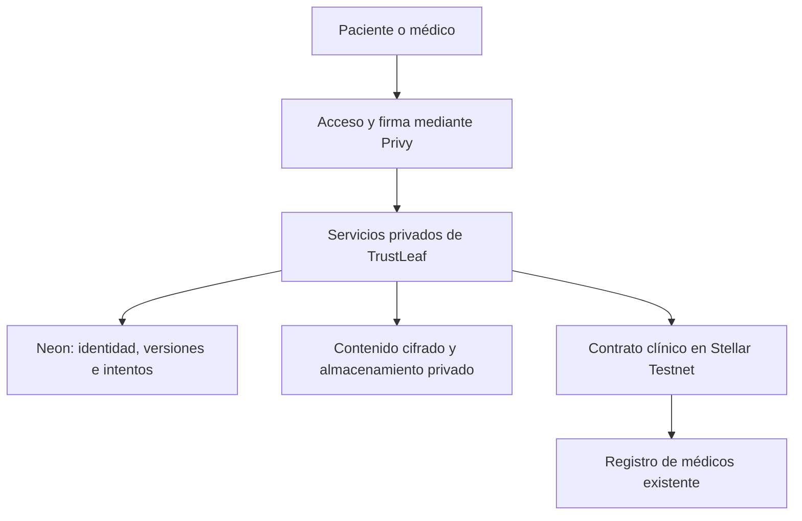

# SOW 2 Diseño de contratos y permisos para la semana 1

Este documento convierte las decisiones sobre la historia clínica privada en un plan de implementación y pruebas. El objetivo de la primera semana es construir una base verificable para los portales del paciente y del médico: permisos, versiones e integridad. La interfaz completa corresponde a las semanas siguientes.

Estado al 5 de octubre de 2026: contrato implementado y desplegado en Testnet; almacenamiento cifrado en Neon dev y demostración técnica real comprobados. CI aprobado para `db9bc2f`; revisión de PR pendiente. Ver VALIDACION-2026-10-05.md para evidencia y límites.

## Decisiones acordadas

- Mantener Neon como base de datos y almacenar allí los PDF, PNG y JPEG cifrados, con límite de 3.000.000 bytes originales por archivo. Pinata e IPFS público quedan fuera de esta primera implementación.
- Contenido clínico cifrado fuera de blockchain. Stellar registra autorizaciones y comprobantes de nuevas versiones, sin nombres, diagnósticos, archivos ni localizadores públicos.
- Separar permiso de lectura y permiso para agregar información. La lectura autorizada abarca la historia completa, incluidos aportes futuros, hasta su revocación.
- Cada aporte o corrección médica requiere autorización médica vigente en TrustLeaf y permiso vigente del paciente. El paciente corrige sus propios aportes; el médico, los suyos. Las versiones anteriores se conservan.
- El nuevo contrato no tendrá una función de actualización de código. Un defecto que requiera cambiar sus reglas obliga a desplegar otro contrato y documentar la transición. Los permisos y las versiones sí cambian mediante sus operaciones autorizadas.
- Trabajar en Stellar Testnet con identidades y datos sintéticos. Conservar los contratos, recibos y datos del SOW 1.

## Lo que existe y lo que falta

| Componente revisado | Uso en SOW 2 |
| --- | --- |
| Registro privado de médicos activo | Reutilizar la comprobación de autorización, vigencia, pausa y revocación. |
| Recetas privadas | Conservar su contrato y comportamiento. Reutilizar patrones de firma, cifrado, verificación y recuperación mediante servicios separados. |
| Identidad Privy y binding de wallet | Reutilizar comprobaciones de pertenencia. La continuidad entre identidad interna, historia y wallet necesita pruebas clínicas propias. |
| Cifrado de documentos privados | Reutilizar AES-GCM, contexto autenticado y comprobantes con aleatoriedad privada. Ampliar para adjuntos; no reutilizar el cifrado legado que permite escribir sin clave. |
| Contrato clínico archivado | Referencia histórica: carece del modelo completo de lectura, versiones y revisiones de permisos. No reactivarlo como solución terminada. |
| Operaciones de recetas | Su tabla exige consulta y acciones específicas de recetas. No introducir historias clínicas mediante consultas ficticias; diseñar persistencia clínica separada y coordinación por wallet. |

La revisión se realizó sobre el checkout local `23355ba`, que contiene documentación pendiente. No es una comprobación del despliegue actual de main. El borrador anterior de `docs/proposals/sow-cycle-2/` trata worker y QR; se conserva como antecedente y no define este diseño clínico.

## Arquitectura propuesta

Neon organiza la información; el almacenamiento conserva los archivos cifrados; Stellar acredita las autorizaciones y los cambios registrados. El servidor aplica el permiso al entregar contenido. Una lectura privada no necesita generar una transacción sólo por abrir el documento.

El contrato y sus eventos son públicos. Aunque no contengan información médica, las wallets, relaciones y tiempos pueden permitir correlaciones. Las pruebas de integridad detectan cambios; no certifican la veracidad clínica. La plataforma administra el descifrado, por lo que el modelo no es cifrado de extremo a extremo ni custodia exclusiva del paciente.

### Un contrato clínico nuevo

Se recomienda un contrato multi-paciente con referencia fija al registro médico existente. Cada historia tiene su propietario y sus permisos independientes. No se requiere un contrato por archivo ni un NFT para representar la historia.

| Capacidad | Regla verificable |
| --- | --- |
| Crear historia | Firma del paciente; referencia opaca vinculada a su wallet. La aplicación mantiene la identidad interna estable fuera de cadena. |
| Conceder o retirar permisos | Firma del paciente propietario; lectura y agregar son independientes. Cada cambio aumenta la revisión del permiso. |
| Registrar aporte | Firma del autor. Para médicos, registro médico y permiso de agregar vigentes. |
| Registrar corrección | Mismo autor original, nueva versión y referencia a la versión previa. Se rechaza una cabeza de versión desactualizada. |
| Consultar evidencia | Metadatos públicos mínimos, permisos, versiones y resultado de una operación; nunca devuelve el documento clínico. |

Las interfaces deberán expresar estas capacidades, la revisión esperada del permiso, la versión previa esperada y un identificador estable de operación. Una firma antigua no debe recuperar un permiso retirado ni crear un aporte después de revocar y volver a conceder acceso. No habrá administrador que cambie el dueño o sustituya el consentimiento del paciente.

El permiso de lectura registrado en cadena no oculta datos del ledger. Se comprueba en el servidor antes de una nueva entrega privada. Como criterio propuesto, un médico debe conservar también su autorización médica para leer; el paciente conserva acceso a su propia historia. Si no puede comprobarse el estado vigente, se rechaza temporalmente la entrega y se ofrece reintento.

No se añade una pausa administrativa al contrato clínico en esta primera propuesta. Los controles de la aplicación pueden detener sus nuevas preparaciones y transmisiones; no impiden por sí solos invocaciones directas al contrato. Esta limitación debe revisarse junto con el modelo de amenazas antes del despliegue inmutable.

### Contenido, comprobantes y claves

El comprobante debe vincular el contenido a su contexto: dominio clínico, red, contrato, historia, autor, entrada y versión. Incluir aleatoriedad privada para evitar publicar hashes directos de datos fáciles de adivinar. Guardar la aleatoriedad y el localizador junto al contenido protegido, fuera de cadena.

Propuesta para los nuevos archivos: cifrado autenticado con clave aleatoria por versión, protegida por una clave de servicio identificada y versionada. Las claves de servicio se guardan separadas de Neon y de los archivos. Antes de habilitar almacenamiento se debe definir y probar respaldo, recuperación y rotación; perder una clave puede hacer irrecuperable el contenido.

Proveedor elegido: Neon de desarrollo. PDF e imágenes se guardan como envelopes cifrados en clinical_private_versions. Se comprobó un PDF de exactamente 3 MB y lectura persistente desde un proceso nuevo. Los costos corresponden al plan de Neon existente; no se contrató otro servicio.

Revocar bloquea posteriores entregas a través de la aplicación; no borra copias ya descargadas. Evitar enlaces públicos o de larga duración que eludan la comprobación de permisos.

### Firmas, intentos y recuperación

Privy mantiene las firmas del paciente y del médico. Cada intención se vincula a identidad, wallet, red, contrato, método, argumentos y vencimiento. El servidor construye la operación y rechaza destinos o sobres arbitrarios aportados por el cliente.

Persistir el intento antes de transmitir y reconciliar su resultado ante respuestas inciertas. No volver a firmar una operación nueva para resolver la incertidumbre de otra. La integración con recetas debe coordinar operaciones activas y secuencia por wallet entre ambos flujos; dos tablas con índices independientes no bastan.

El estado pendiente se mantiene separado del confirmado. Sólo un recibo comprobado y correspondiente a la intención permite declarar el registro confirmado.

## Uso de OpenZeppelin

El MCP de OpenZeppelin Stellar está disponible en esta sesión. Sus generadores cubren familias como cuentas, tokens y gobernanza; no proporcionan una historia clínica lista. Se utilizará su documentación como referencia de revisión y sus componentes únicamente donde coincidan con una necesidad concreta.

`Ownable` representa un dueño global y `AccessControl` una jerarquía de roles. Ninguno sustituye directamente los permisos independientes por paciente. Incorporarlos sin esa distinción podría introducir privilegios ajenos al diseño. Usar una biblioteca o su MCP no acredita la seguridad del código clínico propio.

Los contratos existentes resuelven Soroban SDK `22.0.11` en su lockfile. OpenZeppelin Stellar `0.7.2` declara SDK `26.1.0`; no es una incorporación directa al código actual.

Decisión aplicada: fijar Soroban SDK 22.0.11, compatible con el registro médico existente. El contrato clínico usa permisos específicos por paciente y no incorpora Ownable ni AccessControl globales. No se actualizan las dependencias del SOW 1. El enlace con el registro fue probado localmente y verificado en Testnet. Esta revisión no constituye una auditoría de OpenZeppelin.

Referencias: [MCP oficial](https://mcp.openzeppelin.com/), [manifest de OpenZeppelin 0.7.2](https://github.com/OpenZeppelin/stellar-contracts/blob/v0.7.2/Cargo.toml), [Ownable](https://docs.openzeppelin.com/stellar-contracts/access/ownable) y [Access Control](https://docs.openzeppelin.com/stellar-contracts/access/access-control).

## Orden de implementación

1. **Diseño y compatibilidad.** Cerrar reglas, modelo de amenazas, versiones de herramientas, interfaces y matriz de permisos. Definir proveedor de archivos y gestión de claves sin contratar ni trasladar secretos automáticamente.
2. **Contrato y pruebas.** Implementar historia, permisos, aportes, correcciones e idempotencia. Incorporar TTL y restauración de estado sin perder revocaciones ni reiniciar revisiones. Compilar a WASM y comprobar la integración con el registro médico.
3. **Servicio privado aislado.** Probar identidad, cifrado, comprobantes y entrega autorizada mediante adaptadores. Usar dos pacientes y dos médicos sintéticos, una nota y un adjunto pequeño. Diseñar el journal clínico y la coordinación con operaciones existentes antes de transmitir desde las mismas wallets.
4. **Evidencia de semana 1.** Ejecutar las suites sobre el commit candidato. Después, desplegar y demostrar en un entorno Testnet aislado aprobado, registrando contrato, WASM, configuración y recibos. Separar esta evidencia de los resultados simulados.

La implementación está en codex/sow2-clinical-foundation. Los archivos pendientes anteriores se respaldaron antes de crear la rama; la PR contiene únicamente los cambios clínicos y su evidencia.

Semanas posteriores: portal del paciente y adjuntos en semana 2; aportes médicos e integración con recetas en semana 3; recorrido completo, QA y demostración final en semana 4. Las pruebas de seguridad empiezan en semana 1.

## Matriz de pruebas

La matriz define los controles de aceptación. Los tests locales cubren permisos, identidad, cifrado y recuperación; la demostración real acredita autorización, versiones, lectura íntegra y revocación. La restauración real de un footprint archivado y la integración clínica con Privy quedan expresamente fuera de la evidencia observada hasta ejecutarlas.

| Caso | Resultado esperado |
| --- | --- |
| Otra persona intenta conceder acceso | Rechazo: sólo firma el paciente propietario. El relayer no sustituye esa autorización. |
| Médico con leer, agregar, ambos o ninguno | Cada permiso controla su capacidad; agregar no permite descargar toda la historia. |
| Médico revocado, vencido o registry inaccesible | No se autoriza un nuevo aporte o corrección; comprobar también la regla de lectura propuesta. |
| Revocación y nueva concesión | Rechazar intentos ligados a una revisión anterior; no reactivar acceso mediante una firma tardía. |
| Corrección propia o ajena | Sólo el autor corrige; se conserva la versión anterior; conflicto concurrente rechazado. |
| Doble envío o respuesta RPC perdida | Una operación identificable, sin versión duplicada ni confirmación inventada; recuperación del intento persistido. |
| Documento, clave o contexto alterados | Error antes de entregar contenido; probar cruces de paciente, autor, red, contrato y versión. |
| Sesión vencida o cambio de cuenta | Sin información de la identidad anterior ni respuesta tardía visible. |
| Stellar, Privy o almacenamiento fallan | Error recuperable o pendiente explícito; no conceder usando un permiso antiguo como vigente. |
| Estado archivado o TTL próximo a expirar | Restauración/extensión probadas; no perder propietario, revisiones o barreras contra repetición. |
| ABI, eventos y logs | Sin contenido clínico, nombres de archivo, localizadores, claves o aleatoriedad privada. Documentar metadatos públicos inevitables. |
| Inmutabilidad y regresión | Sin función de upgrade ni bypass administrativo de permisos; recetas e identidad existentes conservan sus pruebas. |

Usar autorización exacta en tests de contrato, no solamente mocks que acepten todas las firmas. Reutilizar fixtures de firmas, binding, integridad y recuperación ya existentes sin iniciar una refactorización general.

Los comandos base son `npm test`, `npm run test:private`, `npx tsc --noEmit`, `npm run build` y las pruebas/build WASM de cada workspace Cargo. Añadir explícitamente las nuevas suites a CI: los scripts privados y el build de contratos enumeran sus archivos o paquetes. No ejecutar scripts on-chain antiguos como si fueran pruebas offline.

## Criterio de cierre de semana 1

La entrega requiere diseño y dependencias fijados, controles implementados, pruebas registradas por commit, WASM reproducible, almacenamiento privado configurado y una demostración Testnet con recibos comprobados. Un harness simulado o un contrato compilado no sustituyen esos resultados.

Decisiones operativas fijadas: Neon dev con 3 MB; claves por versión y KEK versionada fuera de Neon; custodia local DPAPI y respaldo probado bajo la misma cuenta Windows. No existe recuperación portable acreditada ni servicio de claves de producción. El interruptor de escrituras bloquea la herramienta; no impide llamadas directas al contrato. Meet, QR, IPFS público y worker permanente quedan fuera.
